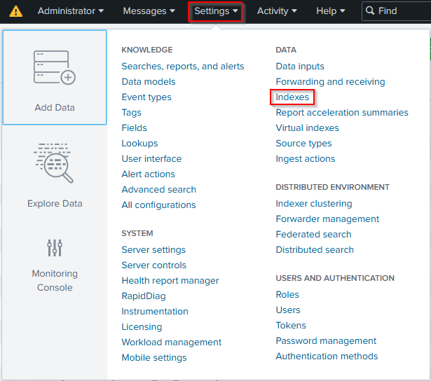
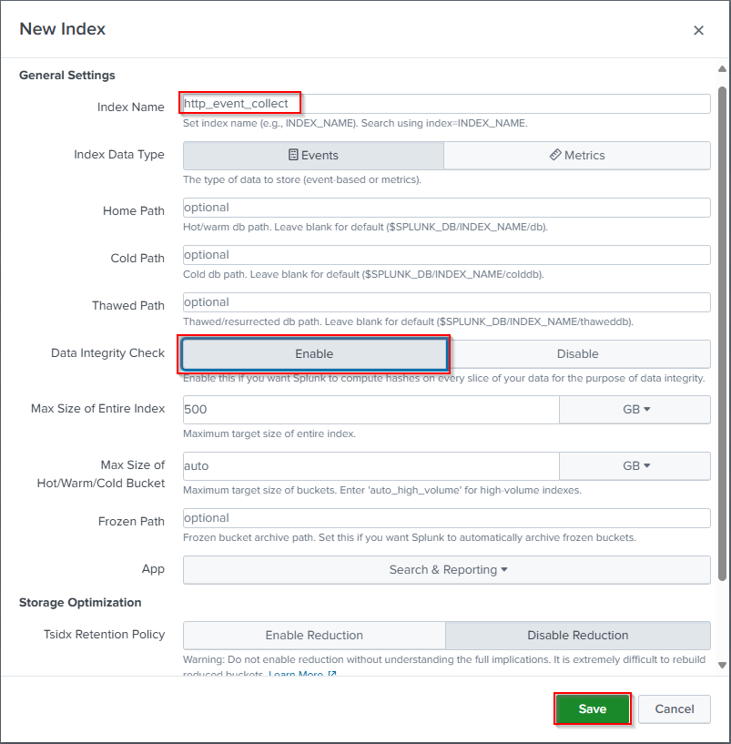
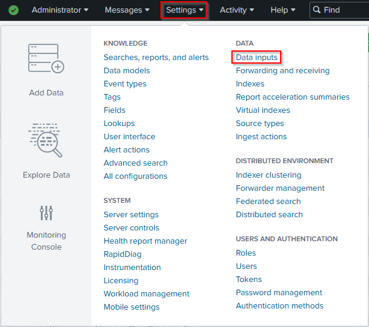
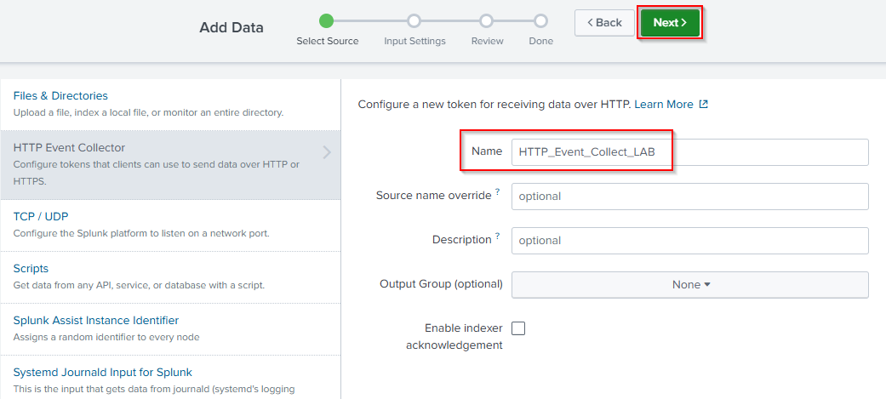
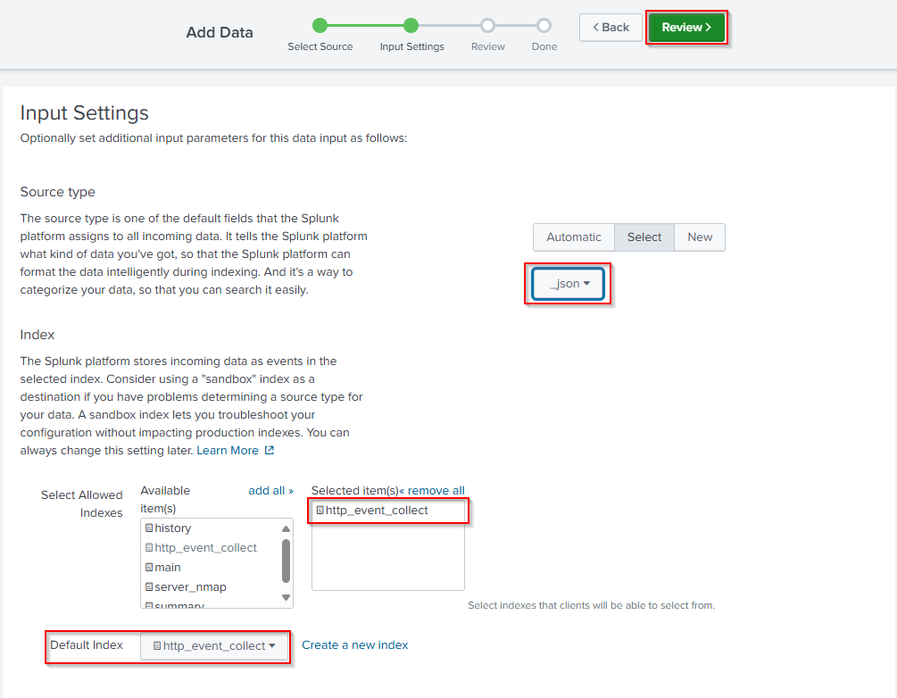
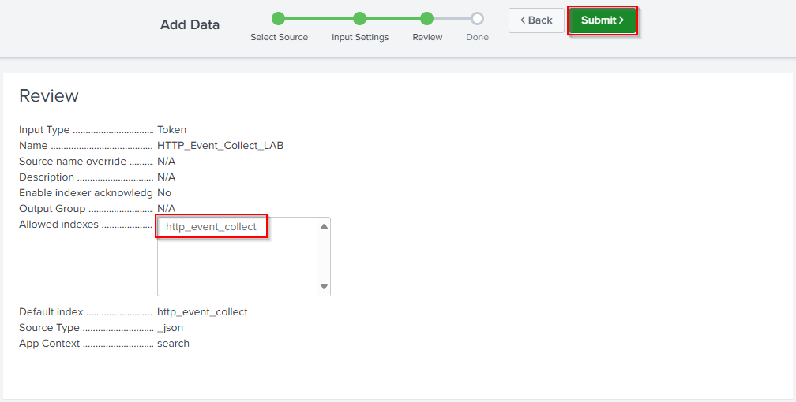
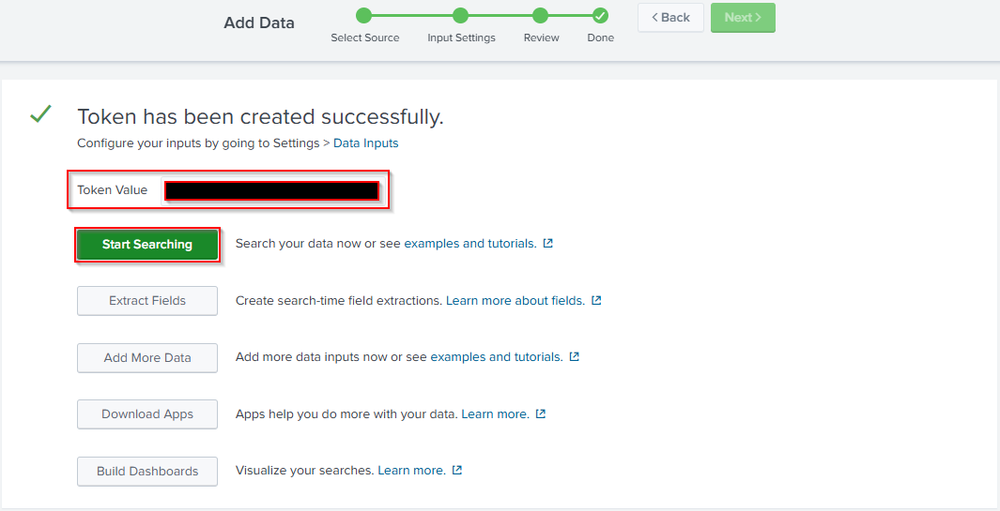
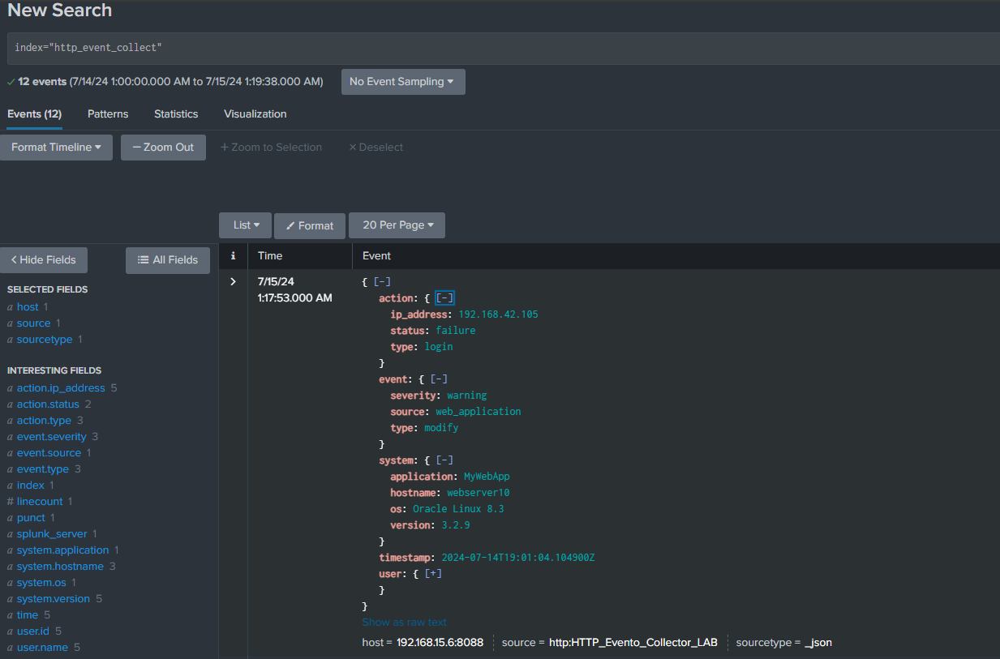

# HTTP Event Collector

## Índice

- [Introdução](#introdução)
- [Configuração do Index](#configuração-do-index)
- [Configuração Data Inputs](#configuração-data-inputs)
- [Testando Envio CURL](#testando-envio-curl)
- [Testando Envio PYTHON](#testando-envio-python)


  
## Introdução
<div align = "justify">
  O HTTP Event Collector (HEC) do Splunk é uma interface que permite enviar dados diretamente para o Splunk por meio de solicitações HTTP ou HTTPS. Ele foi projetado para facilitar a ingestão de dados de várias fontes em tempo real e é especialmente útil para enviar dados de aplicações, serviços web, dispositivos IoT e scripts personalizados.<br><br>
Neste tutorial vou utilizar um código simples em python que envia um arquivo JSON com alguns eventos.<br><br>
  Por ser um tutorial básico do fluxo, estamos utilizando HTTP. E em Global Settings do HTTP Event Collector desativamos o "Enable SSL" para fins de aprendizado.
</div>

## Configuração do Index

<div align = "justify">
  No Splunk, um índice (ou index) é um repositório onde os dados ingeridos são armazenados e organizados. Pense em um índice como um banco de dados que armazena logs e eventos coletados de várias fontes de dados. Cada índice é configurado para armazenar dados de maneira otimizada para pesquisa e análise rápida.<br><br>
</div>

  1. Na console do Splunk:  Clique em Settings -> Indexes.<br><br>
     <br><br>
  2. Clique em New Index -> Atribua um nome ao index e realize as configurações necessárias, e ao final clique em Save.<br><br>
     <br><br>

     Após esta etapa temos o index criado.
  
## Configuração Data Inputs

<div align = "justify">
  O Data Inputs no Splunk é uma funcionalidade que permite configurar as fontes de dados que o Splunk irá monitorar e indexar. Quando você configura um novo Data Input, está essencialmente dizendo ao Splunk onde e como coletar os dados.<br><br>
  Em nosso caso vamos coletar os dados via HEC (HTTP Event Collector).
</div>

  1. Clique em Settings -> Data Inputs.<br><br>
     <br><br>
  2. Em HTTP Event Collector clique em + Add new -> Atribua um nome e clique em Next >.<br><br>
     <br><br>
  3. Selecione o Source Type -> Selecione o Index e clique em Review >.<br><br>
     <br><br>
  4. Após verificar as informações, clique em Submit >.<br><br>
     <br><br>
  5. Agora nosso Token foi criado para utilizarmos em nosso código Python ou diretamente no CURL.<br><br>
     <br><br>

## Testando Envio CURL

  Podemos realizar o teste de envio de eventos via CURL:<br>
  ```
    curl -k http://<splunk_host>:8088/services/collector/event -H "Authorization: Splunk <seu_token>" -d "{\"event\": {\"timestamp\": \"2024-07-14T19:01:04.104900Z\", \"event\": {\"type\": \"modify\", \"source\": \"web_application\", \"severity\": \"warning\"}, \"user\": {\"id\": \"user234\", \"name\": \"User 0\", \"role\": \"user\"}, \"action\": {\"type\": \"login\", \"status\": \"failure\", \"ip_address\": \"192.168.42.105\"}, \"system\": {\"hostname\": \"webserver10\", \"os\": \"Oracle Linux 8.3\", \"application\": \"MyWebApp\", \"version\": \"3.2.9\"}}, \"sourcetype\": \"_json\"}"
  ```

  Substituindo as informações do splunk_host e seu-token temos a resposta:<br>
  
  ```
    {"text":"Success","code":0}
  ```
  E no Splunk com o filtro do index que criamos index="http_event_collect" temos o log:<br><br>
  <br><br>

## Testando Envio PYTHON

  O envio python é basicamente o mesmo que o CURL , mas segue um código básico de como podemos interagir com alguns eventos sendo enviado via HTTP.<br><br>
  ```python
import requests
import json

class SplunkHEC:
    def __init__(self, url, token):
        self.url = url
        self.token = token

    def send_events(self, events):
        headers = {
            'Authorization': f'Splunk {self.token}',
            'Content-Type': 'application/json'
        }
        payload = {'event': events}
        try:
            response = requests.post(self.url, headers=headers, data=json.dumps(payload), verify=False)
            if response.status_code == 200:
                print('Eventos enviados com sucesso!')
            else:
                print(f'Erro ao enviar eventos. Status code: {response.status_code}, Resposta: {response.text}')
        except Exception as e:
            print(f'Ocorreu um erro: {e}')

class Event:
    def __init__(self, timestamp, event_type, source, severity, user_id, user_name, user_role, action_type, action_status, action_ip, hostname, os, application, version):
        self.event_data = {
            "time": timestamp,
            "event": {
                "type": event_type,
                "source": source,
                "severity": severity
            },
            "user": {
                "id": user_id,
                "name": user_name,
                "role": user_role
            },
            "action": {
                "type": action_type,
                "status": action_status,
                "ip_address": action_ip
            },
            "system": {
                "hostname": hostname,
                "os": os,
                "application": application,
                "version": version
            }
        }

    def get_event_data(self):
        return self.event_data

def main():
    # Configurações do Splunk HEC
    splunk_hec_url = 'http://<host_splunk>:8088/services/collector/event'
    splunk_hec_token = '<token>'

    # Instância do SplunkHEC
    splunk = SplunkHEC(splunk_hec_url, splunk_hec_token)

    # Exemplo de eventos
    events = [
        Event("2024-07-14T19:01:04.104900Z", "modify", "web_application", "warning", "user234", "User 0", "user", "login", "failure", "192.168.42.105", "webserver10", "Oracle Linux 8.3", "MyWebApp", "3.2.9").get_event_data(),
        Event("2024-07-14T19:00:34.104900Z", "access", "web_application", "info", "user593", "User 1", "guest", "logout", "success", "192.168.176.55", "webserver8", "Oracle Linux 8.3", "MyWebApp", "1.4.9").get_event_data(),
        Event("2024-07-14T19:00:04.104900Z", "access", "web_application", "warning", "user436", "User 2", "guest", "logout", "failure", "192.168.168.202", "webserver2", "Oracle Linux 8.3", "MyWebApp", "1.7.1").get_event_data(),
        Event("2024-07-14T18:59:34.104900Z", "delete", "web_application", "warning", "user922", "User 3", "guest", "update", "success", "192.168.124.41", "webserver8", "Oracle Linux 8.3", "MyWebApp", "3.4.7").get_event_data(),
        Event("2024-07-14T18:59:04.104900Z", "modify", "web_application", "error", "user143", "User 4", "guest", "logout", "success", "192.168.240.239", "webserver8", "Oracle Linux 8.3", "MyWebApp", "3.3.8").get_event_data()
    ]

    # Enviando eventos para o Splunk HEC
    splunk.send_events(events)

if __name__ == "__main__":
    main()

  ```
  
 E assim finalizamos o tema sobre HEC.


